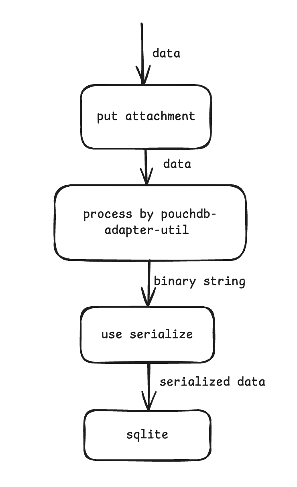
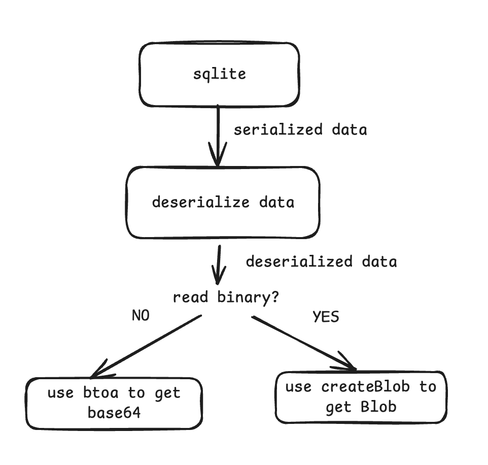

# PouchDB SQLite Adapter

> **Project Status**: This project is currently under active development. While we strive to ensure compatibility across various SQLite implementations (especially for binary data storage), there may still be edge cases. We welcome any issues, suggestions or discussions to help improve the adapter.

This package provides a core implementation of a generic PouchDB SQLite adapter that works with any SQLite database supporting basic SQL operations.

## Design Philosophy

The core design philosophy of this adapter is to support different SQLite implementations through abstraction and interface separation. The adapter's core functionality is decoupled from specific SQLite implementations, enabling the same codebase to work across various platforms and environments.

## Architecture

The adapter follows a layered architecture:

1. **Core Layer**: Implements all PouchDB adapter functionalities including document storage, querying, and attachment handling
2. **Abstract Database Interface Layer**: Defines interfaces for SQLite database interactions
3. **Implementation Layer**: Provides concrete implementations for different SQLite libraries

## Supported SQLite Implementations

Currently supported or planned SQLite implementations:

- [x] [Capacitor SQLite (@capacitor-community/sqlite)](https://github.com/capacitor-community/sqlite)
- [x] [Expo-Sqlite](https://github.com/expo/expo/tree/sdk-52/packages/expo-sqlite)
- [x] [OP SQLite (@op-engineering/op-sqlite)](https://github.com/OP-Engineering/op-sqlite)
- [ ] Other SQLite implementations conforming to the interface specification

## Upcoming Features

1. **More Efficient Attachment Handling**
   Currently, the adapter uses pouchdb's official adapter-util to first convert data to binary string format. However, some SQLite implementations require converting this binary string to Uint8Array for storage. This creates unnecessary overhead when the input data is already in Uint8Array format. We plan to optimize this conversion pipeline to improve performance.

2. **Extended SQLite Support**
   We welcome community contributions through issues and pull requests to add support for additional SQLite implementations. Our roadmap includes expanding compatibility with more SQLite variants.

## Usage

When creating a PouchDB instance, specify the `adapter` name as `sqlite` and configure the `sqliteImplementation` setting. Make sure to first inject the sqlite-core plugin, followed by the specific SQLite implementation plugin.

```typescript
import PouchDB from 'pouchdb';
import SqlitePlugin from 'pouchdb-adapter-sqlite-core';
import ExpoSQLPlugin from 'pouchdb-adapter-expo-sqlite';

const DB = PouchDB.plugin(SqlitePlugin).plugin(ExpoSQLPlugin);

const db = new DB('example', {
  adapter:'sqlite',
  sqliteImplementation: 'expo-sqlite',
});
```

## More Examples
See the example directory for additional usage examples. Database-related code can be found in the db subdirectory.

## Extending Support
To add support for other SQLite implementations, simply create an adapter that implements the abstract database interface.

## Attachment Storage and Retrieval Configuration

 Due to differences across SQLite implementations, platforms, and versions - and potentially requiring different plugins - these options are left for users to configure explicitly. We believe it's important for users to understand how attachment storage and retrieval works.

### Attachment Storage Flow
When storing an attachment via `put_attachment`, the input data can be a string, blob, or ArrayBuffer. The pouchdb-adapter-util converts this data into a binary string. Before storing in SQLite, we call the `serialize` function to transform the binary string, with the result being stored in SQLite.

Note: The current process where pouchdb-adapter-util first converts data to binary string and then sqlite-core transforms it again via serializer may not be the most efficient approach. We plan to optimize this conversion process in future versions.



### Attachment Retrieval Flow
When retrieving an attachment, data is read from SQLite in the format determined by the `serialize` function. The `deserialize` function converts this data back to the required format, which is then processed by either `btoa` or `createBlob`. If these functions aren't provided, default implementations are used (which expect binary string input).

Important: `btoa` must return a base64 string, and `createBlob` must return a Blob object! Incorrect return types may cause database replication failures if your application heavily relies on attachment functionality.



### Serializer Configuration
The `serializer` option allows customization of binary data serialization/deserialization behavior. Data is serialized when stored in SQLite and deserialized when retrieved.

Interface definition:
```typescript
export interface BinarySerializer {
    // Input is raw binary string
    serialize(data: any): any;
    // Input is serialized data (return value from serialize)
    deserialize(data: any): any;
}
```

Example usage for capacitor-sqlite (which has escaping issues with certain characters):
```typescript
import { escapeBlob, unescapeBlob } from 'pouchdb-adapter-sqlite-core';
export const db = new DB('capp2', {
  adapter: 'sqlite',
  sqliteImplementation: 'capicator',
  serializer: {
    serialize: (data) => escapeBlob(data),
    deserialize: (data) => unescapeBlob(data),
  },
});
```

Example for expo-sqlite:
expo-sqlite requires Uint8Array for binary data storage and needs a custom serializer to handle this requirement.
```typescript
serializer: {
  serialize: (data: string) => {
    const binary: string = data;
    const buffer = Buffer.from(binary, 'binary');
    const array = Uint8Array.from(buffer);
    return array;
  },
  deserialize: (data: Uint8Array) => data,
},
```

### btoa and createBlob
The `btoa` option customizes base64 encoding behavior, while `createBlob` customizes Blob creation. If using a custom serializer that doesn't produce binary strings, you must implement these functions.

```typescript
btoa?: (binary: any) => any;
createBlob?: (binary: any, type: any) => any;
```

React Native has limited Blob support which can cause issues when synchronizing attachments across multiple databases. As mentioned earlier, attachment synchronization heavily depends on createBlob implementation. In such cases, you need to construct Blob objects manually.

If you don't implement custom Blob construction, you may encounter errors like: `Creating blobs from 'ArrayBuffer' and 'ArrayBufferView' are not supported`

```typescript
import { getBlobForArrayBuffer } from 'react-native-blob-jsi-helper';
createBlob: (binary: string, type: string) => {
  const buffer = Buffer.from(binary, 'binary');
  const blob = getBlobForArrayBuffer(buffer.buffer);
  return blob;
},
```


## Known Issues and Workarounds

### React Native with PouchDB 9.0.0
When using this adapter with PouchDB 9.0.0 in React Native, you may encounter errors related to `pouchdb-errors`.
To fix it you just need to patch pouchdb-errors library with this version: https://github.com/pouchdb/pouchdb/blob/master/packages/node_modules/pouchdb-errors/src/index.js
You can use patch-package for this. https://www.npmjs.com/package/patch-package

## Acknowledgments
Special thanks to @craftzdog for the open-source project: [pouchdb-adapter-react-native-sqlite](https://github.com/craftzdog/pouchdb-adapter-react-native-sqlite). This project is built upon their implementation.
