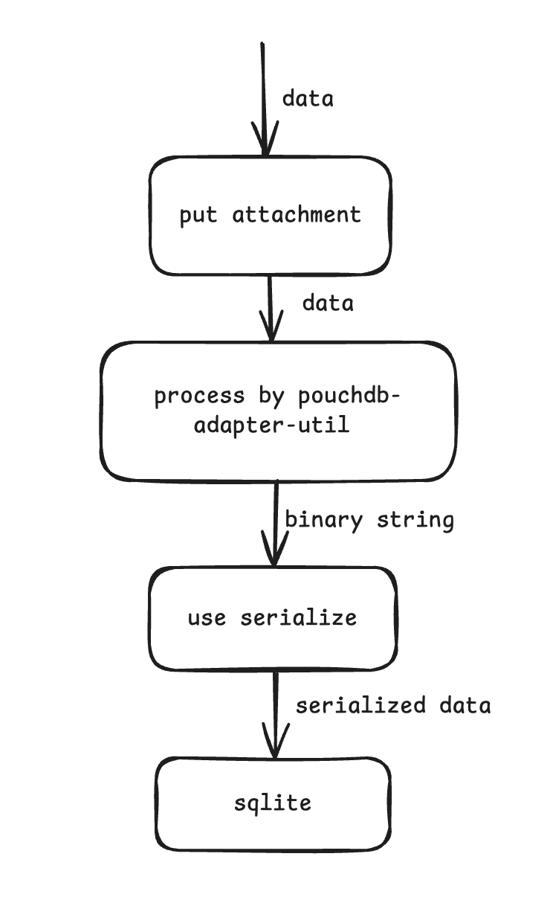
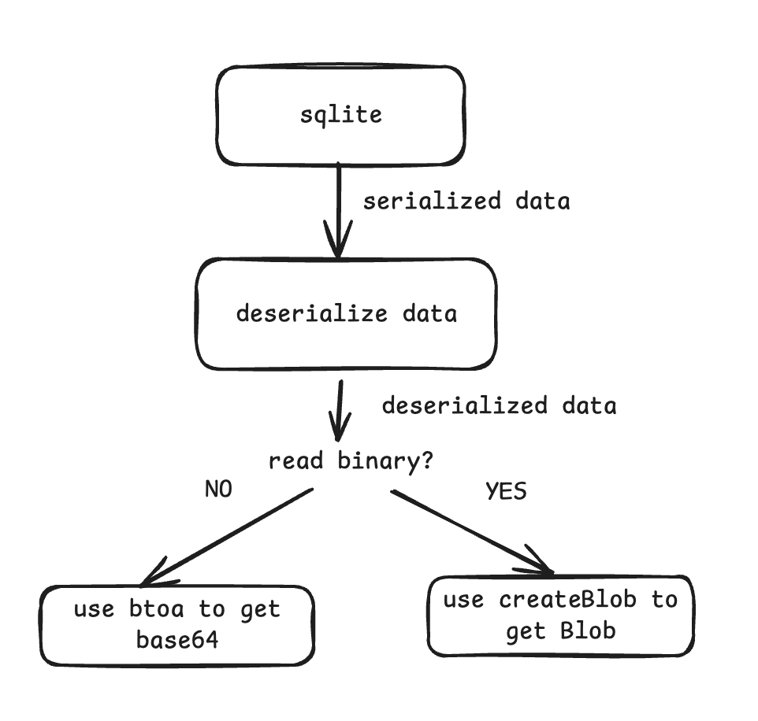

# Attachment Storage and Retrieval Configuration

The serializer, createBlob, and btoa implementations can be configured either:
1. During database initialization (highest priority)
2. When building a custom adapter (secondary priority)
3. Via default implementations (fallback)


Note: You don't need to configure these (serializer/createBlob/btoa) manually 
they're already implemented in adapter. This explanation is provided to help you understand their underlying functionality.

## Attachment Storage Flow
When storing an attachment via `put_attachment`, the input data can be a string, blob, or ArrayBuffer. The pouchdb-adapter-util converts this data into a binary string. Before storing in SQLite, we call the `serialize` function to transform the binary string, with the result being stored in SQLite.

Note: The current process where pouchdb-adapter-util first converts data to binary string and then sqlite-core transforms it again via serializer may not be the most efficient approach. We plan to optimize this conversion process in future versions.

> update: we have optimized the conversion process and removed the unnecessary step of converting data to binary string. The data is now directly stored in some SQLite.
> The serializer will process blob, ArrayBuffer, and base64 data, converting it into storage-compatible formats for SQLite.


## Attachment Retrieval Flow
When retrieving an attachment, data is read from SQLite in the format determined by the `serialize` function. 
The `deserialize` function converts this data back to the required format, which is then processed by either `btoa` or `createBlob`. If these functions aren't provided, default implementations are used (which expect binary string input).

Important: `btoa` must return a base64 string, and `createBlob` must return a Blob object! Incorrect return types may cause database replication failures if your application heavily relies on attachment functionality.



## Serializer Configuration
The `serializer` option allows customization of binary data serialization/deserialization behavior. Data is serialized when stored in SQLite and deserialized when retrieved.

Interface definition:
```typescript
export interface BinarySerializer {
    // Input is may be base64, Blob, ArrayBufer
    serialize(data: any): any;
    // Input is serialized data (return value from serialize)
    deserialize(data: any): any;
}
```

Example usage for capacitor-sqlite (which has escaping issues with certain characters):
```typescript
import { escapeBlob, unescapeBlob } from 'pouchdb-adapter-sqlite-core';
export const db = new DB('cap', {
  adapter: 'sqlite',
  sqliteImplementation: 'capicator',
  serializer: {
    serialize: (data) => escapeBlob(data),
    deserialize: (data) => unescapeBlob(data),
  },
});
```

Example for expo-sqlite:
expo-sqlite requires Uint8Array for binary data storage and needs a custom serializer to handle this requirement.
```typescript
serializer: {
  serialize: (data: string) => {
    // if is a ArrayBuffer, convert to Uint8Array
    if (typeof data === 'object' && data instanceof ArrayBuffer) {
      const array = new Uint8Array(data);
      return array;
    }
    // if is a Blob, convert to Uint8Array
    if (typeof data === 'object' && data instanceof Blob) {
      const promise = new Promise((res) => {
        toBuffer(data, (err, buffer) => {
          if (err) {
            throw err;
          }
          const array = Uint8Array.from(buffer);
          res(array);
        });
      });
      return promise;
    }
    const binary: string = data.toString();
    const buffer = Buffer.from(binary, 'binary');
    const array = Uint8Array.from(buffer);
    return array;
  },
  deserialize: (data: Uint8Array) => data,
},
```

## btoa and createBlob
The `btoa` option customizes base64 encoding behavior, while `createBlob` customizes Blob creation. If using a custom serializer that doesn't produce binary strings, you must implement these functions.

```typescript
btoa?: (binary: any) => any;
createBlob?: (binary: any, type: any) => any;
```

React Native has limited Blob support which can cause issues when synchronizing attachments across multiple databases. As mentioned earlier, attachment synchronization heavily depends on createBlob implementation. In such cases, you need to construct Blob objects manually.

If you don't implement custom Blob construction, you may encounter errors like: `Creating blobs from 'ArrayBuffer' and 'ArrayBufferView' are not supported`

```typescript
import { getBlobForArrayBuffer } from 'react-native-blob-jsi-helper';
createBlob: (binary: string, type: string) => {
  const buffer = Buffer.from(binary, 'binary');
  const blob = getBlobForArrayBuffer(buffer.buffer);
  return blob;
},
```

